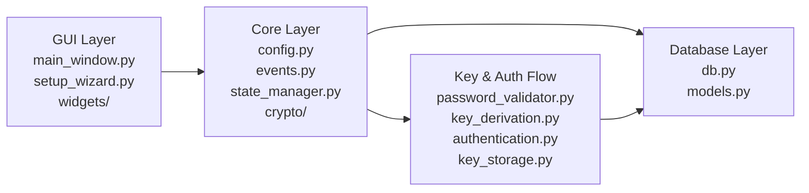

# CryptoSafe Manager

CryptoSafe Manager — локальный менеджер паролей с графическим интерфейсом, SQLite-хранилищем и поэтапным развитием функциональности.

## Видение проекта

Цель проекта — последовательно построить безопасный и расширяемый password manager, в котором:

- доступ к хранилищу защищён мастер-паролем;
- чувствительные данные шифруются и не сохраняются в открытом виде;
- GUI отделён от бизнес-логики и слоя хранения данных;
- новые подсистемы добавляются по спринтам без разрушения базовой архитектуры;
- в финале проект превращается в законченное настольное приложение с документацией, тестами и упаковкой.

На текущем этапе:

- Спринт 1: завершён
- Спринт 2: завершён

## Дорожная карта проекта по спринтам

### Спринт 1. Фундамент приложения

Цель: заложить базовую архитектуру проекта и подготовить минимально рабочее приложение.

Основные задачи:

- модульная структура проекта (`core`, `database`, `gui`, `tests`);
- базовый менеджер конфигурации;
- SQLite-база данных и основные таблицы;
- модели данных;
- событийная система;
- менеджер состояния приложения;
- базовая GUI-оболочка;
- мастер первоначальной настройки;
- абстракция криптографии и временная заглушка шифрования.

### Спринт 2. Мастер-пароль и безопасность доступа

Цель: реализовать безопасную аутентификацию и управление ключами.

Основные задачи:

- хэширование мастер-пароля через Argon2id;
- получение ключа шифрования через PBKDF2;
- хранение метаданных ключа и параметров derivation;
- вход в vault по мастер-паролю;
- смена мастер-пароля;
- политика сложности пароля;
- очистка активного ключа из памяти при блокировке;
- управление сессией пользователя.

### Спринт 3. Полный Vault CRUD и настоящее шифрование записей

Цель: перейти от фундаментальной модели к полноценной работе с записями хранилища.

Планируется:

- создание `src/core/vault/`;
- `EntryManager` для CRUD-операций;
- замена заглушки шифрования на AES-256-GCM;
- отдельное шифрование каждой записи;
- генератор паролей;
- улучшение таблицы записей;
- формы создания и редактирования записей;
- поиск и фильтрация записей.

### Спринт 4. Безопасный clipboard

Цель: реализовать безопасное копирование чувствительных данных во временный буфер обмена.

Планируется:

- отдельная подсистема `core/clipboard/`;
- platform adapters для разных ОС;
- auto-clear буфера обмена;
- мониторинг clipboard;
- уведомления и индикаторы статуса;
- дополнительные защитные меры при копировании паролей.

### Спринт 5. Аудит и контроль целостности логов

Цель: превратить аудит в защищённый и проверяемый журнал событий.

Планируется:

- отдельная подсистема `core/audit/`;
- криптографическая подпись логов;
- hash chain для обнаружения подмены;
- расширенная структура `audit_log`;
- проверка целостности логов;
- GUI-просмотрщик журнала аудита;
- экспорт audit-отчётов.

### Спринт 6. Импорт, экспорт и безопасный обмен

Цель: обеспечить перенос и обмен данными без компрометации основного vault.

Планируется:

- подсистема `core/import_export/`;
- экспорт в защищённые форматы;
- импорт с валидацией и sanitization;
- выборочный экспорт записей;
- безопасный sharing отдельных entry;
- QR-коды и key exchange;
- логирование операций импорта/экспорта.

### Спринт 7. Security hardening и panic mode

Цель: усилить практическую безопасность и добавить защиту в стрессовых сценариях.

Планируется:

- подсистема `core/security/`;
- защита от side-channel атак;
- secure memory management;
- расширенный activity monitor;
- улучшенный auto-lock;
- system tray integration;
- panic mode для экстренной блокировки и очистки чувствительных данных.

### Спринт 8. Финальная интеграция и сдача проекта

Цель: собрать все спринты в законченный продукт, готовый к демонстрации и сдаче.

Планируется:

- финальная интеграция всех модулей;
- удаление `TODO` и технических хвостов;
- полноценный набор тестов;
- отчёт по тестированию и покрытию;
- упаковка через PyInstaller;
- итоговая документация;
- подготовка demo video и презентации.

## Что реализовано на данный момент

### Реализовано в Спринте 1

- модульная архитектура (`core/`, `database/`, `gui/`, `tests/`);
- менеджер конфигурации;
- SQLite-база данных с таблицами `vault_entries`, `audit_log`, `settings`, `key_store`;
- индексы и модели данных;
- `EventBus`;
- `StateManager`;
- базовая GUI-оболочка;
- переиспользуемые виджеты;
- setup wizard;
- криптографическая абстракция и placeholder-реализация.

### Реализовано в Спринте 2

- мастер-пароль и первичная инициализация vault;
- Argon2id для проверки мастер-пароля;
- PBKDF2 для получения encryption key;
- `AuthenticationService`;
- `KeyStorage` и хранение метаданных ключа;
- политика сложности пароля;
- смена мастер-пароля;
- lock/unlock flow;
- очистка ключа из памяти;
- базовая защита от перебора через задержку после неудачных попыток.

## Архитектура (MVC Flow)



## Структура проекта

```text
cryptosafe-manager/
├── src/
│   ├── core/
│   │   ├── crypto/
│   │   │   ├── abstract.py
│   │   │   ├── placeholder.py
│   │   │   ├── key_derivation.py
│   │   │   ├── password_validator.py
│   │   │   ├── authentication.py
│   │   │   └── key_storage.py
│   │   ├── config.py
│   │   ├── events.py
│   │   ├── key_manager.py
│   │   └── state_manager.py
│   ├── database/
│   │   ├── db.py
│   │   └── models.py
│   └── gui/
│       ├── main_window.py
│       ├── setup_wizard.py
│       └── widgets/
│           ├── password_entry.py
│           └── secure_table.py
├── tests/
├── run.py
├── requirements.txt
└── README.md
```

## Установка и запуск

### 1. Клонирование репозитория

```bash
git clone https://github.com/Ray-altq/cryptosafe-manager.git
cd cryptosafe-manager
```

### 2. Создание виртуального окружения

```bash
python -m venv .venv
```

### 3. Активация виртуального окружения

Windows PowerShell:

```powershell
.\.venv\Scripts\Activate.ps1
```

Windows CMD:

```cmd
.venv\Scripts\activate.bat
```

Linux / macOS:

```bash
source .venv/bin/activate
```

### 4. Установка зависимостей

```bash
pip install -r requirements.txt
```

### 5. Запуск приложения

```bash
python run.py
```

## Технологии

- Python 3.10+
- Tkinter
- SQLite
- Argon2id
- PBKDF2
- Cryptography


