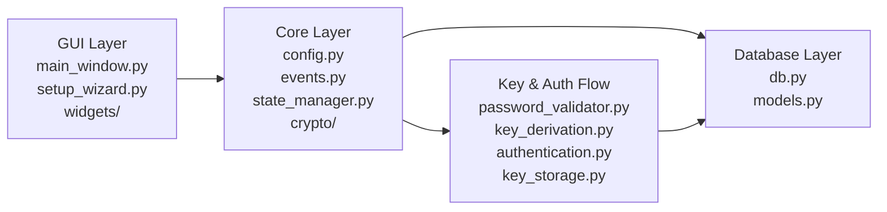

# CryptoSafe Manager

CryptoSafe Manager — локальный менеджер паролей с графическим интерфейсом, SQLite-хранилищем и поэтапным развитием функциональности.

## Видение проекта

Цель проекта — последовательно построить безопасный и расширяемый password manager, в котором:

- доступ к хранилищу защищён мастер-паролем;
- чувствительные данные шифруются и не сохраняются в открытом виде;
- GUI отделён от бизнес-логики и слоя хранения данных;
- новые подсистемы добавляются по спринтам без разрушения базовой архитектуры;
- в финале проект превращается в законченное настольное приложение с документацией, тестами и упаковкой.

На текущем этапе:

- Спринт 1: завершён
- Спринт 2: завершён
- Спринт 3: завершён
- Спринт 4: завершён
- Спринт 5: завершён
- Спринт 6: завершён

## Дорожная карта проекта по спринтам

### Спринт 1. Фундамент приложения

Цель: заложить базовую архитектуру проекта и подготовить минимально рабочее приложение.

Основные задачи:

- модульная структура проекта (`core`, `database`, `gui`, `tests`);
- базовый менеджер конфигурации;
- SQLite-база данных и основные таблицы;
- модели данных;
- событийная система;
- менеджер состояния приложения;
- базовая GUI-оболочка;
- мастер первоначальной настройки;
- абстракция криптографии и временная заглушка шифрования.

### Спринт 2. Мастер-пароль и безопасность доступа

Цель: реализовать безопасную аутентификацию и управление ключами.

Основные задачи:

- хэширование мастер-пароля через Argon2id;
- получение ключа шифрования через PBKDF2;
- хранение метаданных ключа и параметров derivation;
- вход в vault по мастер-паролю;
- смена мастер-пароля;
- политика сложности пароля;
- очистка активного ключа из памяти при блокировке;
- управление сессией пользователя.

### Спринт 3. Полный Vault CRUD и настоящее шифрование записей

Цель: перейти от фундаментальной модели к полноценной работе с записями хранилища.

Основные задачи:

- создание `src/core/vault/`;
- `EntryManager` для CRUD-операций;
- замена заглушки шифрования на AES-256-GCM;
- отдельное шифрование каждой записи;
- генератор паролей;
- улучшение таблицы записей;
- формы создания и редактирования записей;
- поиск и фильтрация записей.

### Спринт 4. Безопасный clipboard

Цель: реализовать безопасное копирование чувствительных данных во временный буфер обмена.

Планируется:

- отдельная подсистема `core/clipboard/`;
- platform adapters для разных ОС;
- auto-clear буфера обмена;
- мониторинг clipboard;
- уведомления и индикаторы статуса;
- дополнительные защитные меры при копировании паролей.

### Спринт 5. Аудит и контроль целостности логов

Цель: превратить аудит в защищённый и проверяемый журнал событий.

Планируется:

- отдельная подсистема `core/audit/`;
- криптографическая подпись логов;
- hash chain для обнаружения подмены;
- расширенная структура `audit_log`;
- проверка целостности логов;
- GUI-просмотрщик журнала аудита;
- экспорт audit-отчётов.

### Спринт 6. Импорт, экспорт и безопасный обмен

Цель: обеспечить перенос и обмен данными без компрометации основного vault.

Планируется:

- подсистема `core/import_export/`;
- экспорт в защищённые форматы;
- импорт с валидацией и sanitization;
- выборочный экспорт записей;
- безопасный sharing отдельных entry;
- QR-коды и key exchange;
- логирование операций импорта/экспорта.

### Спринт 7. Security hardening и panic mode

Цель: усилить практическую безопасность и добавить защиту в стрессовых сценариях.

Планируется:

- подсистема `core/security/`;
- защита от side-channel атак;
- secure memory management;
- расширенный activity monitor;
- улучшенный auto-lock;
- system tray integration;
- panic mode для экстренной блокировки и очистки чувствительных данных.

### Спринт 8. Финальная интеграция и сдача проекта

Цель: собрать все спринты в законченный продукт, готовый к демонстрации и сдаче.

Планируется:

- финальная интеграция всех модулей;
- удаление `TODO` и технических хвостов;
- полноценный набор тестов;
- отчёт по тестированию и покрытию;
- упаковка через PyInstaller;
- итоговая документация;
- подготовка demo video и презентации.

## Что реализовано на данный момент

### Реализовано в Спринте 1

- модульная архитектура (`core/`, `database/`, `gui/`, `tests/`);
- менеджер конфигурации;
- SQLite-база данных с таблицами `vault_entries`, `audit_log`, `settings`, `key_store`;
- индексы и модели данных;
- `EventBus`;
- `StateManager`;
- базовая GUI-оболочка;
- переиспользуемые виджеты;
- setup wizard;
- криптографическая абстракция и placeholder-реализация.

### Реализовано в Спринте 2

- мастер-пароль и первичная инициализация vault;
- Argon2id для проверки мастер-пароля;
- PBKDF2 для получения encryption key;
- `AuthenticationService`;
- `KeyStorage` и хранение метаданных ключа;
- политика сложности пароля;
- смена мастер-пароля;
- lock/unlock flow;
- очистка ключа из памяти;
- базовая защита от перебора через задержку после неудачных попыток.

### Реализовано в Спринте 3

- каталог `src/core/vault/` с `encryption_service.py`, `entry_manager.py`, `password_generator.py` и `search_index.py`;
- настоящее per-entry шифрование записей через AES-256-GCM;
- `EntryManager` с полным CRUD для записей vault;
- миграция схемы БД до версии с `encrypted_data`, `category`, `tags`, `deleted_entries`;
- soft delete записей через `deleted_entries`;
- генератор паролей с настройками длины, наборов символов, исключением неоднозначных символов и историей последних паролей;
- GUI-таблица с multi-select, context menu, сортировкой, изменением размеров и перестановкой колонок;
- отображение `category`, домена URL, даты обновления и колонки пароля в таблице;
- переключение видимости паролей:
  - по записи в таблице;
  - глобально через toolbar;
  - по горячей клавише `Ctrl+Shift+P`;
- форма создания и редактирования записей:
  - `title`, `username`, `password`, `url`, `category`, `tags`, `notes`;
  - валидация обязательных полей и URL;
  - индикатор силы пароля;
  - генерация пароля из диалога;
  - favicon fetching;
  - username suggestions по домену;
- поиск и фильтрация:
  - full-text поиск по `title`, `username`, `url`, `notes`, `tags`;
  - fuzzy matching;
  - field-specific search (`title:`, `user:`, `username:`, `category:`, `url:`, `notes:`, `tag:`/`tags:`);
  - фильтр по категории;
  - фильтр по тегу;
  - фильтр по диапазону даты;
  - фильтр по силе пароля;
  - история последних 10 запросов;
- подготовка модели записи к будущим возможностям:
  - `totp_secret`;
  - `sharing_metadata`;
- connection pooling для базы данных;
- application-layer search index с заделом под future audit integration;
- security-доработки GUI:
  - очистка расшифрованных данных при lock/close;
  - управление временным clipboard;
  - блокировка при сворачивании и потере фокуса по настройкам;
- расширенное тестовое покрытие:
  - encryption round-trip;
  - bulk CRUD;
  - concurrency;
  - search/filter integration;
  - stress test генератора на 10 000 паролей;
  - performance checks на 1000 записей.

### Реализовано в Спринте 4

- каталог `src/core/clipboard/` с `platform_adapter.py`, `clipboard_service.py` и `clipboard_monitor.py`;
- безопасное копирование `password`, `username` и полных данных записи через clipboard service;
- auto-clear буфера обмена с предупреждением перед очисткой и ручной очисткой из интерфейса;
- clipboard monitoring с реакцией на внешнее изменение, внешнюю очистку и подозрительную активность;
- audit/logging для `clipboard_copied`, `clipboard_cleared`, `clipboard_error` и связанных защитных сценариев;
- UI/UX для clipboard:
  - status bar с типом данных, таймером и режимом доставки;
  - preview-диалог с masked preview и раскрытием полного значения после повторной аутентификации;
  - diagnostics-окно для clipboard state, platform backend readiness и memory self-check;
  - notification fallback и optional system tray для clipboard-статуса;
- настройки clipboard:
  - security presets;
  - уровень защиты;
  - уведомления;
  - whitelist разрешённых приложений;
  - режим доставки `system` / `memory_only`;
- per-entry политика копирования через `clipboard_policy` (`allow` / `never`);
- startup recovery и shutdown cleanup для безопасной очистки clipboard после закрытия или сбоя;
- platform adapters и fallback-цепочки для Windows, macOS и Linux:
  - Windows retry/fallback при занятом буфере;
  - `AppKit/NSPasteboard`, `pbcopy/pbpaste` и `osascript` на macOS;
  - `clipboard`, `primary` и `both` selection modes на Linux;
- platform validation report для диагностики доступных backend'ов;
- memory-only режим без записи чувствительного значения в системный clipboard;
- усиленная валидация clipboard payload:
  - запрет пустого значения и `NUL`-символов;
  - лимиты размера по уровню защиты;
  - sanitization метаданных перед отображением и аудитом;
- расширенное тестовое покрытие:
  - unit-тесты для clipboard service, monitor и platform adapters;
  - integration-тесты для copy actions, UI, recovery, preview и diagnostics;
  - concurrency/recovery сценарии;
  - timing/performance smoke tests.

### Реализовано в Спринте 5

- каталог `src/core/audit/` с `audit_logger.py`, `log_signer.py`, `log_verifier.py` и `log_formatters.py`;
- audit logging интегрирован с событийной системой и отделён от бизнес-логики;
- отдельный signing key через HKDF-контекст `audit-signing`;
- Ed25519 для подписи логов и HMAC-SHA256 fallback;
- hash chain с `sequence_number`, `previous_hash`, `entry_hash` и подписью каждой записи;
- UTC timestamp и метаданные источника времени для audit-записей;
- sanitization чувствительных данных перед записью в аудит;
- расширенная схема БД для `audit_log`, `audit_public_keys`, `audit_archives` и `audit_security_log`;
- append-only защита audit log через database triggers;
- AES-256-GCM encryption at rest для `entry_data`;
- индексы по `timestamp`, `event_type` и `sequence_number`;
- configurable retention/rotation policy с архивированием старых логов;
- startup, periodic и manual integrity verification;
- отдельный secure log для tampering/protection events;
- GUI-просмотрщик audit trail с таблицей, сортировкой, фильтрами, поиском и пагинацией;
- details panel со структурированным JSON, статусом подписи и hash chain данными;
- dashboard со статистикой, security metrics, integrity status и графиком частоты событий за 7/30/90 дней;
- context integration для vault operation entries и failed login событий;
- экспорт audit log в signed JSON, CSV, PDF и CEF;
- encrypted export package для чувствительных экспортов и re-auth перед экспортом;
- scheduled exports, date ranges и cleanup старых экспортов;
- async logging для non-critical events;
- integration hooks для будущих import/export, panic mode и TOTP-событий;
- тесты TEST-1..TEST-5: tampering, performance, export/import, graceful recovery, SQL injection/protection.

### Реализовано в Спринте 6

- каталог `src/core/import_export/` с отдельными сервисами экспорта, импорта, sharing, key exchange и QR-обмена;
- защищённый native export в JSON с AES-GCM, PBKDF2, integrity checksum, HMAC и опциональным GZIP-сжатием;
- public-key export для передачи vault получателю через RSA-OAEP/AES-GCM;
- password-protected encrypted JSON для Bitwarden без plaintext-файла на диске;
- импорт vault с preview/dry-run, режимами `merge`/`replace`, стратегиями обработки дублей и валидацией входных данных;
- поддержка миграционного импорта из CSV, LastPass CSV и Bitwarden JSON;
- выборочный экспорт записей и выбор полей для переноса;
- безопасный sharing отдельных записей без раскрытия всего vault;
- share package по паролю и share package через публичный ключ получателя;
- key exchange с генерацией RSA-ключей, fingerprint, payload, SVG/PNG QR-кодами и ограничением срока действия;
- QR-обмен для публичных ключей и share package;
- GUI-диалоги импорта, экспорта, sharing и QR/key exchange со scroll/touchpad support и безопасными настройками по умолчанию;
- audit logging для операций импорта, экспорта, sharing и key exchange;
- история операций импорта/экспорта в базе данных;
- тесты для encrypted export/import, Bitwarden encrypted JSON, selected export, import preview, sharing, QR/key exchange, GUI helper'ов и интеграции с audit.

## Архитектура (MVC Flow)



## Структура проекта

```text
cryptosafe-manager/
├── .github/
├── src/
│   ├── core/
│   │   ├── audit/
│   │   │   ├── __init__.py
│   │   │   ├── audit_logger.py
│   │   │   ├── log_formatters.py
│   │   │   ├── log_signer.py
│   │   │   └── log_verifier.py
│   │   ├── clipboard/
│   │   │   ├── __init__.py
│   │   │   ├── clipboard_monitor.py
│   │   │   ├── clipboard_service.py
│   │   │   └── platform_adapter.py
│   │   ├── crypto/
│   │   │   ├── abstract.py
│   │   │   ├── authentication.py
│   │   │   ├── key_derivation.py
│   │   │   ├── key_storage.py
│   │   │   ├── password_validator.py
│   │   │   └── placeholder.py
│   │   ├── import_export/
│   │   │   ├── formats/
│   │   │   │   ├── __init__.py
│   │   │   │   ├── csv_format.py
│   │   │   │   ├── json_format.py
│   │   │   │   └── password_manager.py
│   │   │   ├── __init__.py
│   │   │   ├── crypto.py
│   │   │   ├── exceptions.py
│   │   │   ├── exporter.py
│   │   │   ├── importer.py
│   │   │   ├── key_exchange.py
│   │   │   ├── models.py
│   │   │   └── sharing_service.py
│   │   ├── vault/
│   │   │   ├── __init__.py
│   │   │   ├── encryption_service.py
│   │   │   ├── entry_manager.py
│   │   │   ├── password_generator.py
│   │   │   └── search_index.py
│   │   ├── config.py
│   │   ├── events.py
│   │   ├── key_manager.py
│   │   └── state_manager.py
│   ├── database/
│   │   ├── db.py
│   │   └── models.py
│   └── gui/
│       ├── __init__.py
│       ├── main_window.py
│       ├── setup_wizard.py
│       └── widgets/
│           ├── __init__.py
│           ├── password_entry.py
│           └── secure_table.py
├── tests/
│   ├── clipboard_memory_dump_helper.py
│   ├── test_audit.py
│   ├── test_authentication.py
│   ├── test_clipboard.py
│   ├── test_config.py
│   ├── test_crypto.py
│   ├── test_database.py
│   ├── test_entry_manager.py
│   ├── test_events.py
│   ├── test_import_export.py
│   ├── test_integration.py
│   ├── test_key_derivation.py
│   ├── test_password_generator.py
│   ├── test_password_validator.py
│   ├── test_platform_adapter.py
│   ├── test_run_memory_dump.py
│   ├── test_search_index.py
│   ├── test_secure_table.py
│   ├── test_setup.py
│   └── test_vault_encryption.py
├── .gitignore
├── README.md
├── requirements.txt
└── run.py
```

## Установка и запуск

### 1. Клонирование репозитория

```bash
git clone https://github.com/Ray-altq/cryptosafe-manager.git
cd cryptosafe-manager
```

### 2. Создание виртуального окружения

```bash
python -m venv .venv
```

### 3. Активация виртуального окружения

Windows PowerShell:

```powershell
.\.venv\Scripts\Activate.ps1
```

Windows CMD:

```cmd
.venv\Scripts\activate.bat
```

Linux / macOS:

```bash
source .venv/bin/activate
```

### 4. Установка зависимостей

```bash
pip install -r requirements.txt
```

### 5. Запуск приложения

```bash
python run.py
```

## Технологии

- Python 3.10+
- Tkinter
- SQLite
- Argon2id
- PBKDF2
- Cryptography
